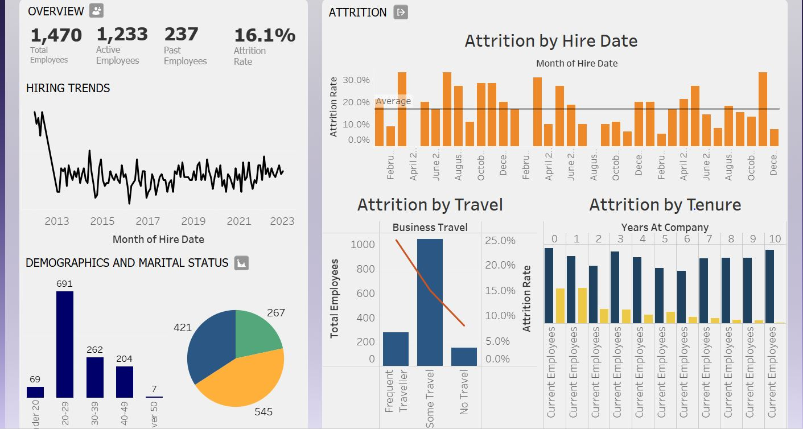

# 👥 Atlas HR Dashboard – Tableau Project

## 📊 Overview  
This Tableau project presents a comprehensive and interactive **HR analytics dashboard** focused on **employee attrition**, **hiring trends**, **demographics**, and **tenure analysis**. The dashboard provides clear visibility into workforce dynamics, helping HR professionals make informed decisions to reduce turnover and optimize hiring and retention strategies.

---

## 🎯 Project Objective  
To build a strategic HR dashboard that enables:

- Monitoring of current and past employee distribution  
- Identifying attrition patterns by date, tenure, and travel frequency  
- Understanding workforce demographics and diversity  
- Supporting evidence-based HR decisions

---

## 🧩 Key Features

### 1. Employee Overview  
- Total Employees, Active Employees, Past Employees  
- Overall Attrition Rate (%)  
- Hiring trends over time (2013–2023)

### 2. Demographics and Marital Status  
- Employee age distribution (e.g., majority between 20–29)  
- Pie chart breakdown of marital status across the organization

### 3. Attrition Analysis  
- **Attrition by Hire Date**: Monthly pattern of resignations  
- **Attrition by Business Travel**: Correlation between travel frequency and attrition risk  
- **Attrition by Tenure**: Comparison of attrition across years of service

---

## 📈 Dashboard Highlights

- 📌 1,470 total employees analyzed, with 237 attritions (16.1%)  
- 📅 Peak hiring and attrition patterns identified by month and year  
- 📊 Travel-heavy employees (frequent travelers) show higher attrition risk  
- 📈 Early-tenure employees (0–2 years) account for a large portion of turnover  
- 🎯 Real-time interactivity through dropdown filters and tooltips

---

## 🧠 Key Insights

- 📉 Highest attrition rates occur within the first 2 years of employment  
- 🛄 Employees who travel frequently are more likely to leave  
- 🧑 Most employees fall into the 20–29 age range, indicating a younger workforce  
- 💍 Marital status insights may help tailor engagement strategies

---

## 📌 Recommendations

1. **Target Early-Tenure Engagement**  
   Develop onboarding and mentorship programs to support employees in their first 2 years.

2. **Review Travel Policies**  
   Consider alternate roles or flexibility for frequent business travelers to reduce burnout-related turnover.

3. **Personalize Retention Strategies**  
   Use demographic and marital data to tailor retention and benefits programs.

4. **Improve Hiring Cycle Monitoring**  
   Use hiring trend charts to better align recruitment efforts with business needs.

---

## ✅ Conclusion  
This project demonstrates strong Tableau capabilities in:

- ✅ HR analytics and visualization design  
- ✅ Data storytelling using attrition and demographic KPIs  
- ✅ Creating dashboards for executive decision-making  
- ✅ Using filters, charts, and tooltips to create a user-friendly experience

The final dashboard equips HR teams with real-time insight into workforce behavior, attrition risks, and diversity metrics — empowering proactive planning and smarter people decisions.

---

## 🛠️ Tools Used  
- Tableau Desktop (`.twbx`)  
- Public/sample HR dataset  
- Custom visualization features: filters, pie charts, bar graphs, line trends

---

## 📎 Files Included  
- `Atlas HR.twbx` – Packaged Tableau workbook  
- `Atlas_HR.JPG` – Main dashboard screenshot  
- `Atlas Labs BG.png` – Custom dashboard background image
- `Employee.csv` – Employee master dataset
- `EducationLevel.csv` – Education level reference data
- `PerformanceRating.csv` – Employee performance evaluation data
---
